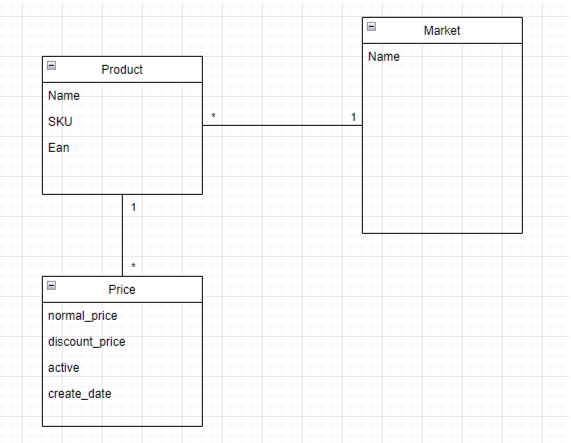

# coolebra_prueba_tecnica

# Preguntas



1. Mediante una query SQL, obtener los productos indicando su último menor precio activo, EAN, SKU y su mercado (market).
   - (no respondido)
2. Teniendo en cuenta el modelo de la imagen 1, describa con palabras un proceso que tenga que ser ejecutado cada cierto tiempo (automatización) y que obtenga información “relevante” diferente a la pedida en la pregunta 1.
   - Obtener descuentos `(normal_price - discount_price)*100/normal_price` inactivos de cada producto indicando su descuento, EAN, SKU y mercado, con esta información se podría entender algún tipo de periodicidad en los descuentos.
3. Basándose en los datos obtenidos en la respuesta de la pregunta 1
   1. Escribir una función en Python que recorra los datos y agrupe los productos mediante su Ean en el siguiente diccionario
   
    ```json
    {
        "Ean": {
                "nombre producto (asumir que los productos con mismo Ean tienen el mismo nombre)",
                "datos de la query": [ 
                    "listado de los datos que vienen en la query", 
                ],
                "cantidad de markets diferentes",
                "rango de precios (Mayor precio - Menor precio)"
        },
    }
    ```
    
   - (respondido en directorio `pregunta-3.1`)
   2. El diccionario anterior debe ser recorrido mediante React, en donde se debe crear componentes HTML que contendrán el nombre del producto, el rango de precios y en cuántos mercados diferentes se encuentra. Poner un input en donde se puede filtrar los productos que se ven por su nombre y utilizando hooks (useEffect) hacer que los productos que no se deben ver vayan desapareciendo 1 a 1 cada segundo.
   - (respondido en directorio `pregunta-3.2`)

- Consideraciones:
  - No es necesario que el HTML tenga CSS o algún tipo de estilo.
  - El arreglo de diccionarios puede estar definido como constante dentro de React y su data debe ser inventada, al menos 3 Eans diferentes.
  - Al cargar la página se debe poder ver el HTML creado
  - Diagrama sobre precios de los productos. SKU es un valor único que lo relaciona con el mercado, Ean es un identificador único que lo provee el proveedor del producto a nivel mercado. Un producto en diferentes mercados puede tener el mismo Ean, pero diferente SKU.
